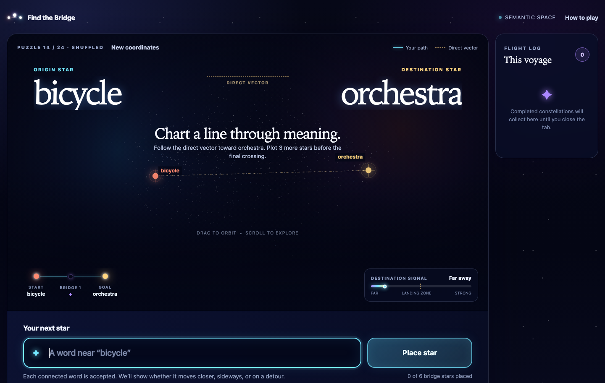

# Find the Bridge

A small browser game about connecting distant ideas with a short chain of words.

[](https://find-the-bridge.t-vasilikioti.chatgpt.site)

The player starts with one word and enters bridge words one at a time. A word is accepted when it is semantically close enough to the current word. The game labels each accepted move as **Closer**, **Sideways**, or **Detour** based on its relationship to the destination. After at least three accepted bridges, the player can finish when the current word is close enough to the destination. Each puzzle allows at most six bridge words and three undos.

## Run locally

The game has no runtime dependencies or build step. Serve the static directory so the browser can load its binary embedding files:

```sh
python3 -m http.server 4173 -d dist
```

Then open `http://localhost:4173`.

Run the scoring checks with:

```sh
node tests/scoring.test.mjs
node tests/embeddings.test.mjs
node scripts/validate-puzzles.mjs
```

## Architecture

- `dist/index.html` contains the game surface and accessible structure.
- `dist/styles.css` contains the responsive visual system.
- `dist/app.js` owns sequential play, local session history, results, Canvas animation, and optional WebMCP actions.
- `dist/scoring.mjs` contains acceptance thresholds, cosine similarity, step labels, and route scoring.
- `dist/data/` contains the fixed vocabulary, quantized vectors, global PCA coordinates, and curated puzzle deck used in the browser.
- `scripts/build-embeddings.mjs` reproduces the static data from a pretrained model.
- `tests/scoring.test.mjs` checks the scoring invariants.

Everything runs in the browser. There is no backend, account, paid API, or network call after the static files load.

## Embeddings

The game uses approximately 10,000 common content words extracted from 50-dimensional GloVe vectors. GloVe is intentionally conservative here: it is small enough for a browser game, well understood, and its pretrained data is distributed under the Public Domain Dedication and License. The source model is `glove-wiki-gigaword-50`, derived from [Stanford GloVe](https://nlp.stanford.edu/projects/glove/).

Each vector is L2-normalized offline. In plain language, this scales every vector to the same length, so cosine similarity compares direction—semantic relationship—rather than raw magnitude. Each normalized value is then stored as a signed 8-bit integer. The browser data payload is about 680 KB before transfer compression:

- 500 KB for approximately 10,000 × 50 quantized embedding dimensions.
- 80 KB for two projection coordinates per word.
- About 100 KB for vocabulary and puzzle metadata.

A static CSV would not provide row-level database queries in the browser. Without a server or a separately maintained byte index, the browser would still download and parse the entire CSV. The indexed binary layout is smaller and lets the browser jump directly to a word's fixed-width vector.

The two PCA dimensions are only for drawing the map. Scoring always uses all 50 dimensions. Increasing the drawing projection to 32 dimensions would not improve a two-dimensional screen visualization; it would only create an intermediate representation that still has to be projected down to two.

To rebuild the data, pass a gzipped word2vec-format GloVe file:

```sh
node scripts/build-embeddings.mjs /path/to/glove-wiki-gigaword-50.gz
```

## Future improvements

- Upgrade the current 50-dimensional GloVe vectors to 300 dimensions while preserving the static, browser-only architecture and 8-bit storage. For approximately 10,000 words, this would increase the uncompressed vector payload from about 500 KB to about 3 MB.
- Build a representative benchmark of clearly related and unrelated word pairs, then recalibrate the move-acceptance and destination thresholds against real false positives and false negatives.
- Explore a small association margin for words that make strong progress toward the destination but fall just below the connection threshold for the immediately preceding word.
- Add an optional, privacy-preserving playtesting log or export for rejected guesses so recurring false negatives can be reviewed instead of tuning the model from anecdotes.
- Compare higher-dimensional GloVe with a more modern embedding model. More dimensions should retain additional semantic signal, but a newer model may be needed to substantially improve polysemy and broader human associations.
- Investigate contextual or phrase-level representations so ambiguous words such as `bank` are not limited to a single vector that blends several meanings.

## Word acceptance

Words are submitted sequentially instead of filling every slot in advance. A bridge is accepted when:

1. It exists in the fixed vocabulary.
2. It has not already appeared in the route.
3. Its cosine similarity to the current word is at least `0.20`.

The `0.20` threshold deliberately permits lateral “leap” guesses. It is isolated in `scoring.mjs` so playtesting can tune it without changing the interface. Progress toward the destination is guidance rather than a gate: a move is **Closer** when destination similarity rises by at least `0.03`, **Detour** when it falls by at least `0.03`, and **Sideways** in between. This lets players take meaningful lateral routes without accepting unrelated words.

The final crossing becomes available after three bridge words when the current word has at least `0.34` similarity to the destination. If the player reaches six words without that proximity, they can undo and try another direction.

During play, a destination-pull meter and the three direction labels show progress without exposing raw embedding values. The meter uses a fixed scale from **Far** through **Landing zone** to **Strong bridge**, so it keeps distinguishing words after the finishing threshold is crossed.

When the final crossing unlocks, a celebratory dialog presents the provisional route score and asks the player to **Finish & see route** or **Keep improving**. Every score display says that higher is better. An additional bridge raises the score only when its stronger connections outweigh the small efficiency penalty for using another word; the player sees the score change immediately and can undo a poor experiment while undos remain. Unused bridge spaces are not rendered as unfinished fields; the route shows only placed words and the single next available space.

## Scoring

Cosine similarity is transformed into step quality on a 0–1 scale. Both similarity and the final 0–100 route score are higher-is-better; the interface consistently calls the raw value **connection strength** so it is not confused with cosine distance, whose direction would be reversed. The quality mapping is a product choice, not a standard embedding formula; it makes raw similarities easier to combine and tune for a game.

```text
continuity =
  50% × geometric mean of step qualities
+ 35% × weakest step
+ 15% × average quality, reduced when steps are inconsistent

score = 100 × continuity × progression × efficiency
```

“Mean quality” is the ordinary average of all normalized step qualities. It is multiplied by a consistency factor, so a route with one unusually weak jump does not receive the same credit as a uniformly strong route.

The geometric mean and explicit weakest-step term ensure that one excellent pair cannot compensate for an implausible jump. Closer moves receive a modest progression advantage over sideways moves and detours, while the efficiency multiplier gives shorter comparable routes a small advantage.

## Session history and visualization

Completed scores are stored in `sessionStorage`. They survive refreshes in the same tab but disappear when the tab's session ends. That provides a lightweight sense of a play session without introducing a database or identity system.

The semantic map uses the Canvas API. It draws the vocabulary as a faint field, then animates the completed route with a sketch-like line and interactive word markers. Every completed-route crossing is also a real button that spotlights its segment on the map, and the weakest link is labeled explicitly. This keeps the visual playful without adding an animation framework.

Acceptance, destination proximity, direction labels, and scoring always use all 50 embedding dimensions. Only the visualization uses the two offline PCA coordinates. The interface explicitly describes that map as a flattened approximation rather than the space used for judging routes.

A dismissible three-step walkthrough opens on the first visit and remains available from **How to play**. Its dismissed state is stored locally in the browser.

## Puzzle deck

The browser loads 24 curated start/end pairs and shuffles them at the beginning of every session. Reaching the end of the deck reshuffles it while avoiding an immediate repeat. The endpoints remain curated rather than selecting arbitrary vocabulary words, which keeps each round distant but reasonably bridgeable.

Examples include `volcano → bank`, `bee → democracy`, `glacier → coffee`, `feather → justice`, `pillow → space`, and `rocket → courtroom`. The full deck lives in `dist/data/puzzles.json`. Each puzzle also contains a precomputed, curated `strongRoute`. Players can optionally reveal it after finishing; it is presented as another good route rather than an authoritative best answer. `scripts/validate-puzzles.mjs` checks every reference route against the live vocabulary and gameplay thresholds.

## Cloudflare deployment

Cloudflare's current Git setup creates a Worker with static assets rather than showing the older Pages output-directory form. The site is still entirely static: [`wrangler.jsonc`](wrangler.jsonc) tells Cloudflare to publish the committed `dist/` directory.

On the **Configure your Worker project** screen, use:

- Project name: `find-the-bridge`
- Build command: leave empty
- Deploy command: `npx wrangler deploy`
- Preview command: `npx wrangler preview`
- Root directory: leave at the repository root, if that field is shown

Then select **Save and Deploy**. The production branch defaults to the repository's default branch (`main`); after creation, it can be checked under **Settings → Build → Branch control**. Every subsequent push to `main` will produce a production deployment.

The same configuration can be deployed directly from the repository with:

```sh
npx wrangler deploy
```

Daily puzzles, sharing, hints, generated shortest paths, multiplayer, accounts, and phrase embeddings are deliberately deferred.
